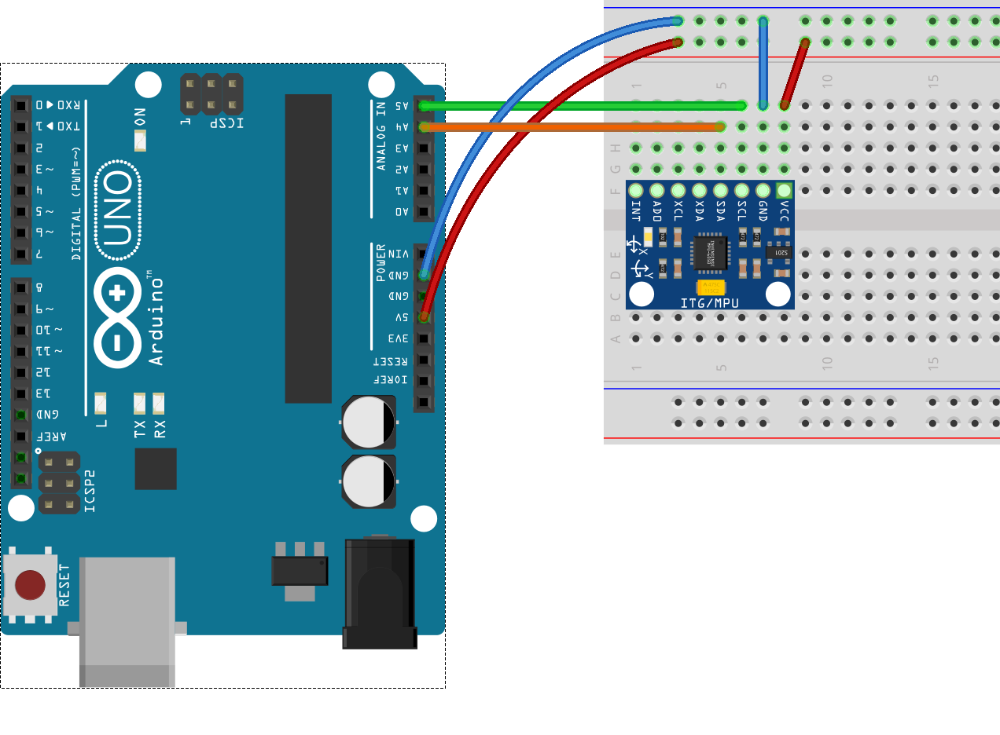

# Lab 3 Introduction to I2C and SPI
> It is mandetory to prepare your documents in `Markdown` format. We prepared an example repository in [Lab Report Sample](https://github.com/efrei-paris-sud/2019-sample-project/tree/master/lab/1). 
> All needed codes described in this repository. For more details about markdown please visit the [Example Report](https://github.com/efrei-paris-sud/2019-sample-project/tree/master/lab/1/report/1)

Put all reports into `lab/3/` folder in your repository. 
> Report Deadline = 24/11/2019

## I2C
I2C is a serial protocol for two-wire interface to connect low-speed devices.

Each device has a preset ID or a unique device address so the master can choose with which devices will be communicating. So many devices can communicate together with only 2 wires!

The two wires, or lines are called Serial Clock (or SCL) and Serial Data (or SDA).  The SCL line is the clock signal which synchronize the data transfer between the devices on the I2C bus and it’s generated by the master device. The other line is the SDA line which carries the data.


The two lines are “open-drain” which means that pull up resistors needs to be attached to them so that the lines are high because the devices on the I2C bus are active low. Commonly used values for the resistors are from 2K for higher speeds at about 400 kbps, to 10K for lower speed at about 100 kbps. [More info on I2C](https://howtomechatronics.com/tutorials/arduino/how-i2c-communication-works-and-how-to-use-it-with-arduino/)

> BME 280 
> The GY-BME280 is a high precision combined digital pressure, humidity and temperature sensor module with I2C and SPI interfaces.
> 


Connect your arduino to bme280 using following sketch.
- VCC -> 5V
- GNF -> GND
- SCL -> A5
- SDA -> A4


To add BME280 Library goto `Tools` -> `Library Manager` -> search for `BME280`
### Part 1
Please use the example added from `File-> Example->BME280->bmetest`
- Upload the code on(`lab/3/report/1/code1.ino`).
- Create a Fritzing sketch and export it on (`lab/3/report/1/sketch1.png`).
- Take a photo from your board (`lab/3/report/1/photo1.png`).
- Write a short report on (`lab/3/report/1/README.md`)

### Part 2
Connect your arduino to ESP32 using I2C.

Arduino|	ESP32
-|-
SDA (A4)	|SDA (default is GPIO 21)
SCL	(A5)  |SCL (default is GPIO 22)
GND	| GND 
VCC	| usually 3.3V or 5V (not needed if you are connected by usb)

- Create a Fritzing sketch and export it on (`lab/3/report/2/sketch2.png`).
- Upload the code on(`lab/2/report/3/arduino2.ino`, `lab/3/report/2/esp2.ino`).
- Take a photo from your board (`lab/3/report/2/photo2.png`).
- Write a short report on what is the following codes will do (`lab/3/report/2/README.md`) don't forget to include images in README.md

> Note: ESP32 has no slave mode.

Code for ESP32 for being in Master mode.
```C 
#include <Wire.h>
// Include the required Wire library for I2C<br>#include 
int x = 0;
void setup() {
  // Start the I2C Bus as Master
  Wire.begin(); 
}
void loop() {
  Wire.beginTransmission(9); // transmit to device #9
  Wire.write(x);              // sends x 
  Wire.endTransmission();    // stop transmitting
  x++; // Increment x
  if (x > 5) x = 0; // `reset x once it gets 6
  delay(500);
}
```
Code For Slave (Arduino)
```C
#include <Wire.h>

// Include the required Wire library for I2C<br>#include <Wire.h>
int LED = LED_BUILTIN;
int x = 0;
void setup() {
  // Define the LED pin as Output
  Serial.begin(9600);
  pinMode (LED, OUTPUT);
  // Start the I2C Bus as Slave on address 9
  Wire.begin(9);
  Serial.println("Ok"); 
  
  // Attach a function to trigger when something is received.
  Wire.onReceive(receiveEvent);
}
void receiveEvent(int bytes) {
  x = Wire.read();    // read one character from the I2C
  Serial.println(x); 
}
void loop() {
  //If value received is 0 blink LED for 200 ms
  if (x == 0) {
    digitalWrite(LED, HIGH);
    delay(200);
    digitalWrite(LED, LOW);
    delay(200);
  }
  //If value received is 3 blink LED for 400 ms
  if (x == 3) {
    digitalWrite(LED, HIGH);
    delay(400);
    digitalWrite(LED, LOW);
    delay(400);
  }
}
```
### Part 3 
Get your GY-521 module.
This module has the MPU6050 which contains both a 3-Axis Gyroscope and a 3-Axis accelerometer allowing measurements of both independently, but all based around the same axes, thus eliminating the problems of cross-axis errors when using separate devices.
Connect your arduino to MPU6050 using following sketch.
- VCC -> 5V
- GNF -> GND
- SCL -> A5
- SDA -> A4



To add MPU6050 Library goto `Tools` -> `Library Manager` -> search for `MPU6050`

Look for Example added in File->Examples-> MPU6050 -> plotter

Upload it to arduino and see result in Serial.


### Part 4
- Connect ESP32, Arduino, MPU6050 and BME280 using I2C
- Set Arduino as Slave with i2c address = 12 
- In Arudino write a code to :
  - Read input analog from A0 which is connected to a variable resistor. (Hint Practice 2)
  - Send the value to ESP32 using I2C

- Set ESP32 as Master
- In ESP32 write a code to: 
  - Read data from BME280 
  - Read Value from Arduino (Read one byte [Hint](https://www.arduino.cc/en/Tutorial/MasterReader))
  - Read data from MPU6050
  - Write values to the serial. ( put space between values and newline in each read) .
  > Example: 
  ```
  Temperature Pressure Humidity arduinoinput acceleration.x acceleration.y acceleration.z  gyro.x gyro.y gyro.z
  ```
- Plot data in spreadsheet. (Copy all data in Serial Console to Excel and plot using that) `lab/3/report/4/plot1.png`
- Plot data in realtime (hint: review practice 2 in lab-two) `lab/3/report/4/plot2.png`
  
- Create a Fritzing sketch and export it on (`lab/3/report/4/sketch.png`).
- Upload the code on(`lab/3/report/4/arduino.ino`, `lab/3/report/4/esp.ino`).
- Take a photo from your board (`lab/3/report/4/photo.png`).
- Write a short report on how it works in (`lab/3/report/4/README.md`) don't forget to include images in README.md.


## Exercise 1 (SPI) Deadline = 30/11/2019 
SPI (Serial Peripheral Interface) is a serial communication protocol. SPI interface was found by Motorola in 1970. SPI has a full duplex connection, which means that the data is sent and received simultaneously. That is a master can send data to slave and a slave can send data to master simultaneously. SPI is synchronous serial communication means the clock is required for communication purpose.

SPI has following four lines MISO, MOSI, SS, and CLK

- MISO (Master in Slave Out) or SDO (Slave Data Out)- The Slave line for sending data to the master.
- MOSI (Master Out Slave In) or SDI (Slave Data In) - The Master line for sending data to the peripherals.
- SCK (Serial Clock) - The clock pulses which synchronize data transmission generated by the master.
- SS (Slave Select) – Master can use this pin to enable and disable specific devices.
 


To start communication between master and slave we need to set the required device's Slave Select (SS) pin to LOW, so that it can communicate with the master. When it's high, it ignores the master. This allows you to have multiple SPI devices sharing the same MISO, MOSI, and CLK lines of master. 


Connect the BME280 to **ESP32** via SPI. [More Info](http://cactus.io/hookups/sensors/barometric/bme280/hookup-arduino-to-bme280-barometric-pressure-sensor-spi)
- Don't fotget to use ESP32
- Find `MISO` `MOSI` `SCK` `SSS` in the pin maps from Lab 1 Readme file for ESP32.
- Create a Fritzing sketch and export it on (`lab/3/exercise/1/sketch.png`).
- Upload the code on(`lab/3/exercise/1/esp.ino`).
- Take a photo from your board (`lab/3/exercise/1/photo.png`).
- Write a short report on how it works in (`lab/3/exercise/1/README.md`) don't forget to include images in README.md.
- Enumare the differences between SPI and I2C in the README.md.
